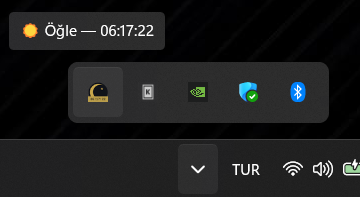
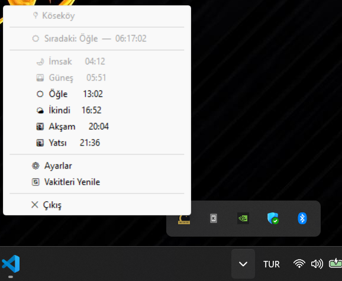
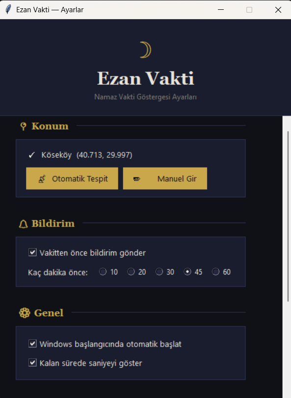

# Ezan Vakti

Windows görev çubuğunda çalışan, namaz vakitlerini takip eden sade bir masaüstü uygulaması.

Namaz vakitlerini ayrı bir uygulama açıp bakmak yerine, ekranın sağ alt köşesinde her an görmek istedim. Bir sonraki vakite kalan süre ikonun üzerinde yazıyor, vakit yaklaşınca bildirim geliyor.

---

## Ne Yapar

- Diyanet İşleri Başkanlığı hesaplama metoduyla namaz vakitlerini çeker
- Sistem saatinin yanında hilal ikonu olarak durur, üzerinde kalan süreyi gösterir
- Vakit yaklaşınca Windows bildirimi gönderir
- Bilgisayar açılışında otomatik başlar
- İnternet kesilse bile gün boyu cache'den çalışmaya devam eder
- Konum otomatik tespit edilir, istenirse elle de girilebilir

---

## Kurulum

Python 3.10 veya üzeri gerekli.

```bash
pip install -r requirements.txt
python main.py
```

İlk açılışta konum otomatik tespit edilir. Tespit edilemezse ayarlar penceresi açılır, şehir adını yazman yeterli.

---

## Exe Olarak Derlemek

```bash
pip install pyinstaller
pyinstaller ezan_vakti.spec
```

`dist/EzanVakti.exe` oluşur. Python kurulu olmayan bilgisayarlarda da çalışır.

---

## Kullanılan Kütüphaneler

| Kütüphane | Ne İçin |
|-----------|---------|
| pystray | Sistem tepsisi ikonu |
| Pillow | İkon çizimi |
| requests | Namaz vakti API'si |
| winotify | Windows bildirimleri |
| tkinter | Ayarlar penceresi |

Namaz vakitleri [Aladhan API](https://aladhan.com/prayer-times-api) üzerinden, Diyanet metodu (Method 13) ile hesaplanıyor.

---






---

